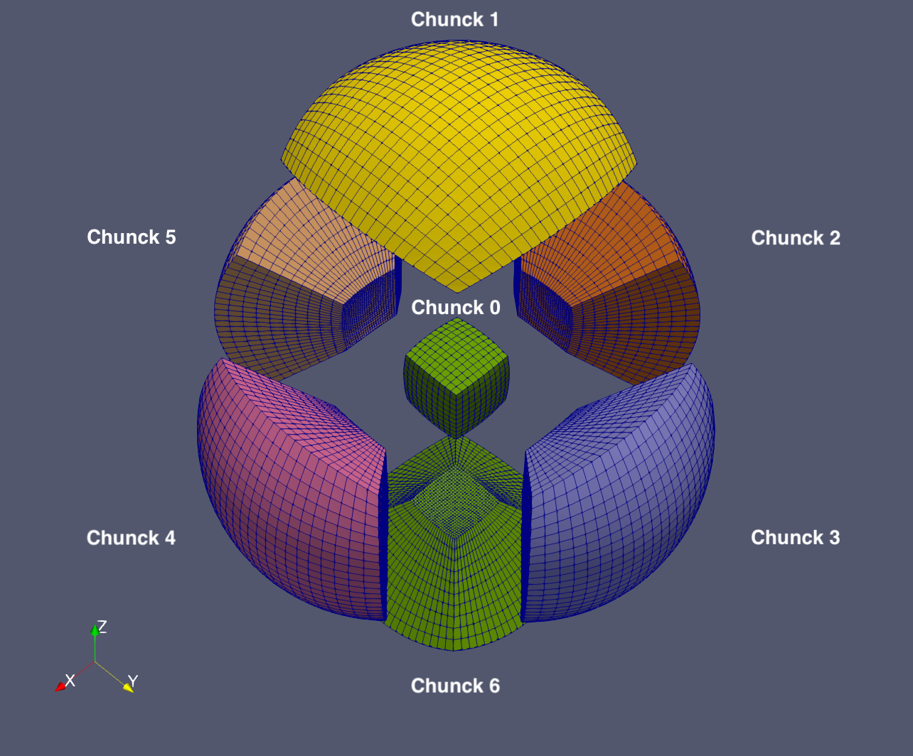

Hi, this is the DFDM github organization site to host a family of distributional finite-difference method code repositories

We (Barbara Romanowicz, Chao Lyu, Jean Virieux, Jianwei Ma, Liang Zhao, Muaaz Awan, Peter Moczo, Yann Capdeville, Yder Masson) are dedicated to open-source development for the computational seismology community.
If you want to follow and participate the development of DFDM, please follow us and contribute it.
If you use own code to implement your project, please cite at least one paper below

## Fundings Support
National Science Foundation (EAR-1758198) Barbara Romanowicz    
Young Scientists Fund of the National Natural Science Foundation of China (Grant No. 42004045) Chao Lyu     
Strategic Priority Research Program of the Chinese Acasemy ofSciences (Grant No. XDB42020102) Liang Zhao   
France-Berkeley fund (Grant: No. FBF-10-2019)  Yder Masson and Barbara Romanowicz  
Agence Nationale de la Recherche (Grant: No. 16-IDEX-0002)  Yder Masson   

## Presentations Related
2024.05 SSA Alaska. Chao Lyu, Yder Masson,Muaaz Gul Awan, Barbara Romanowicz. The ongoing development of distributional finite difference method in global seismology.   
2023.12 AGU San Francisco. Chao Lyu, Yder Masson, Liang Zhao, Barbara Romanowicz. Distributional finite difference method for 3D seismic wave propagation. (S21A-02)   
2022.12 AGU Chicago. Yder Masson, Chao Lyu, Barbara Romanowicz. Three-dimensional distributional finite-difference modelling of elastic wave propagation in a heterogeneous Earth. (S21A-09)    

## References
### Under Review

### In preparation
<a id="1">[1]</a> Chao Lyu, Yder Masson, Liang Zhao, Barbara Romanowicz, and Jean Virieux. A stable first-order perfectly matched layer condition via the distributional finite-difference method for the acoustic wave propagation modeling.  
<a id="2">[2]</a> Chao Lyu, Yder Masson, Liang Zhao, Barbara Romanowicz, Jean Virieux. The discontinuous displacement distribution of fluid-fluid coupling of wave numerical modeling.

### Published
<a id="1">[1]</a> Yder Masson. Distributional finite-difference modelling of seismic waves. Geophysical Journal International, Volume 233, Issue 1, April 2023, Pages 264–296, https://doi.org/10.1093/gji/ggac306.  
<a id="2">[2]</a> Yder Masson and Jean Virieux. P-SV-wave propagation in heterogeneous media: Velocity-stress distributional finite-difference method. GEOPHYSICS 2023 88:3, T165-T183, https://doi.org/10.1190/geo2022-0118.1    
<a id="1">[3]</a> Yder Masson, Chao Lyu, Peter Moczo, Yann Capdeville, Barbara Romanowicz. 2D seismic wave propagation using the distributional finite-difference method: further developments and potential for global seismology, GJI, https://doi.org/10.1093/gji/ggae025
<a id="4">[4]</a> Chao Lyu, Yder Masson, Barbara Romanowicz, Liang Zhao. Introduction to the distributional finite-difference method for three-dimensional seismic wave propagation. JGR Solid Earth, https://doi.org/10.1029/2023JB027576
